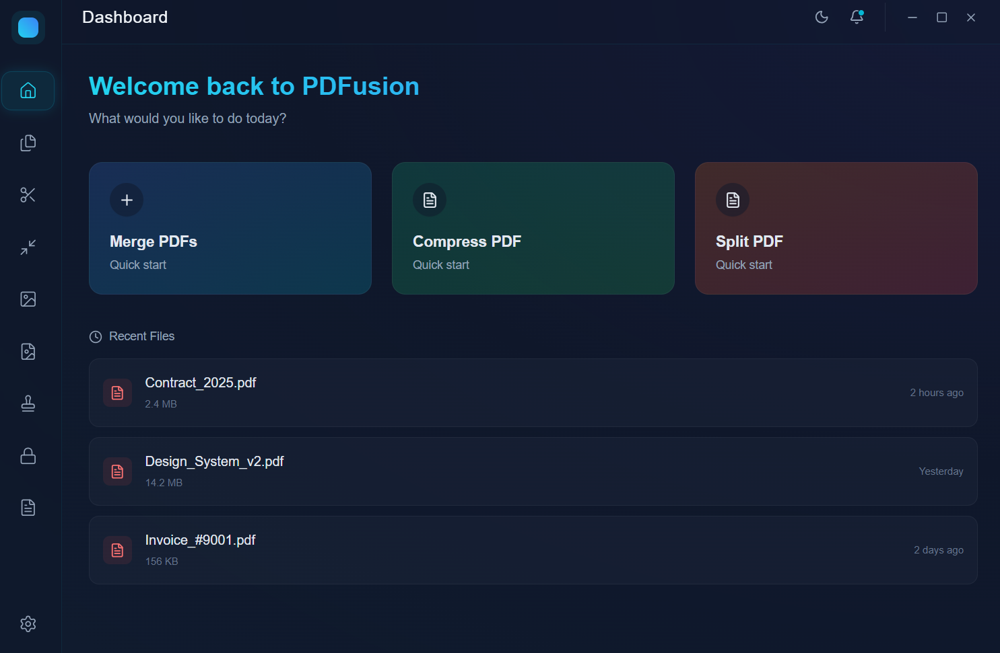

# PDFusion ⚡📄

**PDFusion** is a modern, high-performance desktop PDF toolkit built with **Tauri**, **React**, and **Rust**. It features a premium "Glassmorphism" UI with dark mode, smooth animations, and a secure, offline-first architecture.. 



## 🚀 Features

*   **Merge PDFs**: Combine multiple PDF files into one document.
*   **Split PDFs**: Extract pages or split documents into individual files.
*   **Metadata**: View properties like page count, title, and author.
*   **Pure Rust Backend**: All core operations run natively in Rust using `lopdf`.
*   **Modern UI**: Built with Tailwind CSS, Framer Motion, and Glassmorphism effects.
*   **No External Dependencies**: Works out-of-the-box (No Java, Python, or QPDF required).

> **Note**: Advanced features like Compression, Encryption, and Rotation are currently disabled in the Pure Rust build to ensure zero external dependencies.

## 🛠️ Tech Stack

*   **Frontend**: React, TypeScript, Vite
*   **Styling**: Tailwind CSS, PostCSS, Lucide Icons
*   **State Management**: Zustand
*   **Animations**: Framer Motion
*   **Backend**: Rust (Tauri)
*   **PDF Library**: `lopdf` (Pure Rust)

## 📦 Installation & Build

### Prerequisites
*   [Node.js](https://nodejs.org/) (v16+)
*   [Rust](https://www.rust-lang.org/tools/install) (latest stable)

### Development
```bash
# Install dependencies
npm install

# Run in development mode
npm run tauri dev
```

### Build for Production
To create a standalone `.exe` installer:
```bash
npm run tauri build
```
The installer will be generated at:
`src-tauri/target/release/bundle/nsis/PDFusion_0.1.0_x64-setup.exe`

## 📂 Project Structure

*   `src/`: React frontend (Pages, Components, Tools)
*   `src-tauri/`: Rust backend and build configuration
    *   `src/pdf.rs`: Pure Rust implementation of PDF operations
    *   `src/lib.rs`: Tauri command handlers

## 📝 License

MIT
